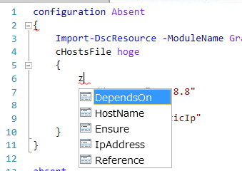

Grani_HostsFile
============

DSC Resource to configure hosts Entry.

Resource Information
----

Name | FriendlyName | ModuleName 
-----|-----|-----
Grani_HostsFile | cHostsFile | GraniResource

Test Status
----

See GraniResource.Test for the detail.

Method | Result
----|----
Pester| pass
Configuration| pass
Get-DSCConfiguration| pass
Test-DSCConfiguration| pass

Intellisense
----



Sample
====

StaticIp
----

You can specify StaticIp to be resolve for the host entry. This allow you to specify IP which is not belong to DnsServer.

This force you to recreate mof, when host ip is changed.

- Add Host Entry for StaticIp

This will add hosts Entry to resolve google.com as 8.8.8.8

```powershell
configuration present
{
    Import-DscResource -ModuleName GraniResource
    cHostsFile hoge
    {
        HostName = "google.com"
        IpAddress = "8.8.8.8"
        Ensure = "Present"
        Reference = "StaticIp"
    }    
}
```

- Remove HostEntry for StaticIp

This will remove hosts Entry to resolve google.com as 8.8.8.8

```powershell
configuration Absent
{
    Import-DscResource -ModuleName GraniResource
    cHostsFile hoge
    {
        HostName = "google.com"
        IpAddress = "8.8.8.8"
        Ensure = "Absent"
        Reference = "StaticIp"
    }    
}
```

DnsServer
----

You can specify DnsServer to be resolve for the host entry. This allow you dynamically update host entry by node.

- Add Host Entry for DnsServer

This will add hosts entry to google.com, which is resolved by DnsServer on 8.8.8.8

```powershell
configuration present
{
    Import-DscResource -ModuleName GraniResource
    cHostsFile hoge
    {
        HostName = "google.com"
        IpAddress = "8.8.8.8"
        Ensure = "Present"
        Reference = "DnsServer" # as this is default, you can omit it
    }    
}
```

- Remove HostEntry for DnsServer

This will remove hosts Entry to resolve google.com, which is resolved by DnsServer on 8.8.8.8

```powershell
configuration Absent
{
    Import-DscResource -ModuleName GraniResource
    cHostsFile hoge
    {
        HostName = "google.com"
        IpAddress = "8.8.8.8"
        Ensure = "Absent"
        Reference = "DnsServer" # as this is default, you can omit it
    }    
}
```
