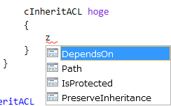
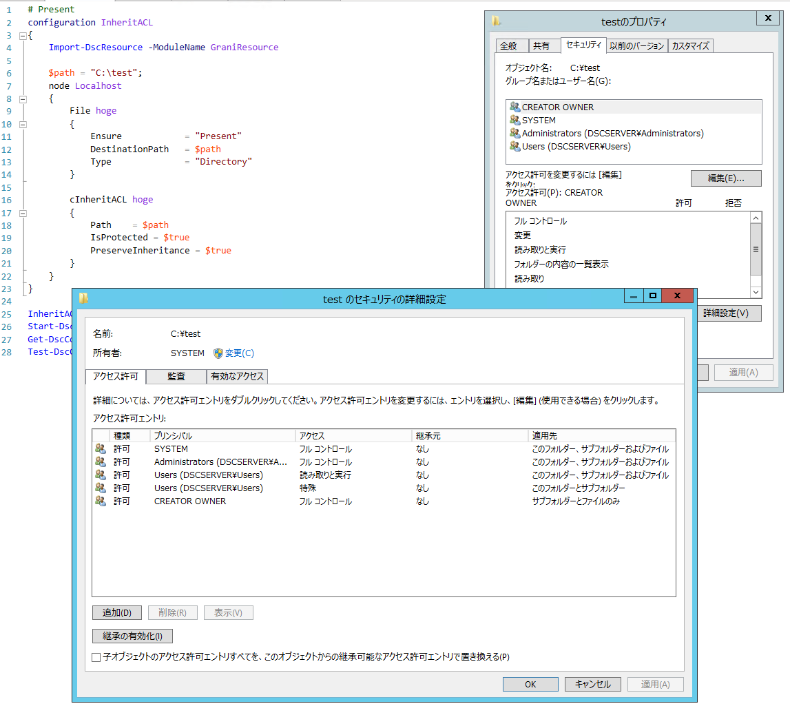
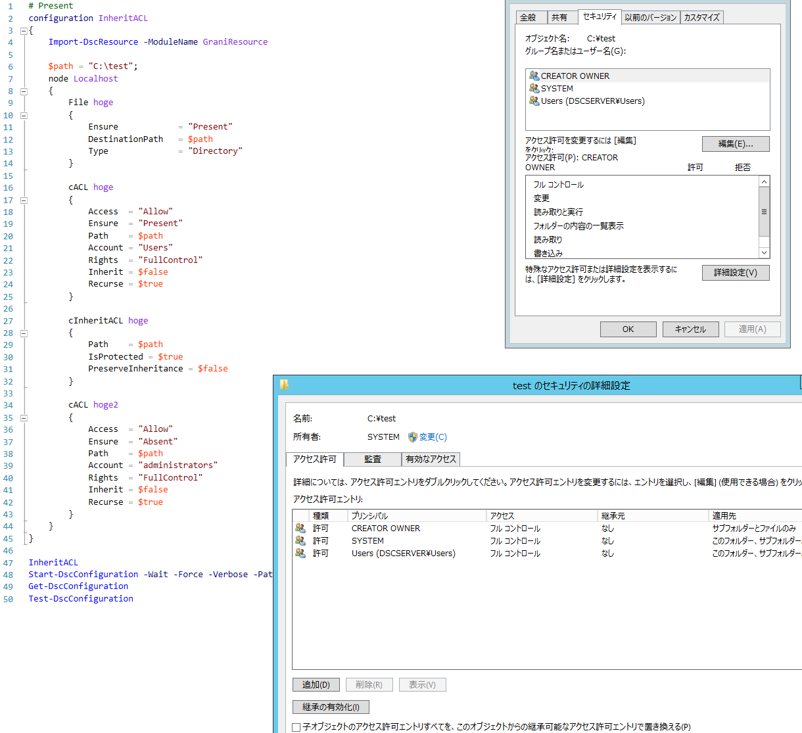

Grani_InheritACL
============

DSC Resource to configure ACL Inheritance for NTFS.

Resource Information
----

Name | FriendlyName | ModuleName
-----|-----|-----
Grani_InheritACL | cInheritACL | GraniResource

Test Status
----

See GraniResource.Test for the detail.

Method | Result
----|----
Pester| pass
Configuration| pass
Get-DSCConfiguration| pass
Test-DSCConfiguration| pass

Intellisense
----



Sample
----

### Change Folder to "Protected" with "PreserveInheritance".

```powershell
configuration InheritACL
{
    Import-DscResource -ModuleName GraniResource

    $path = "C:\test";
    node Localhost
    {
        File hoge
        {
            Ensure            = "Present"
            DestinationPath   = $path
            Type              = "Directory"
        }

        cInheritACL hoge
        {
            Path    = $path
            IsProtected = $true
            PreserveInheritance = $true
        }
    }
}
```

As you can see there are no inheritance from parent, and inheritaed access rules are keep as they are.


### Change Folder to "Protected" with "NoPreserveInheritance".

**You should promise there are one or more "no inherited access rule(s)"  are already set to target.**

Because "IsProtected = $false" with "PreserveInheritance = $false" means remove all inherited access rule. Configuration will protect none of access rule left for target. (Because it means you can not touch any more!)

Sample show you how to set non-inherited access rule with cACL beforehand.

```powershell
configuration InheritACL
{
    Import-DscResource -ModuleName GraniResource

    $path = "C:\test";
    node Localhost
    {
        File hoge
        {
            Ensure            = "Present"
            DestinationPath   = $path
            Type              = "Directory"
        }

        # Create non inherited Aceess before change to protected w/ non preserve
        cACL hoge
        {
            Access  = "Allow"
            Ensure  = "Present"
            Path    = $path
            Account = "Users"
            Rights  = "FullControl"
            Inherit = $false
            Recurse = $true
        }

        cInheritACL hoge
        {
            Path    = $path
            IsProtected = $true
            PreserveInheritance = $false
        }

        # Promise remove AccessRule which you don't want to set
        cACL hoge2
        {
            Access  = "Allow"
            Ensure  = "Absent"
            Path    = $path
            Account = "administrators"
            Rights  = "FullControl"
            Inherit = $false
            Recurse = $true
        }
    }
}
```




Tips
----

**ACL Management**

cInheritACL will provide only how you want to handle NTFS Inheritance. It means this resource will not touch any AccessRule.

You can use cACL to manage ACL.