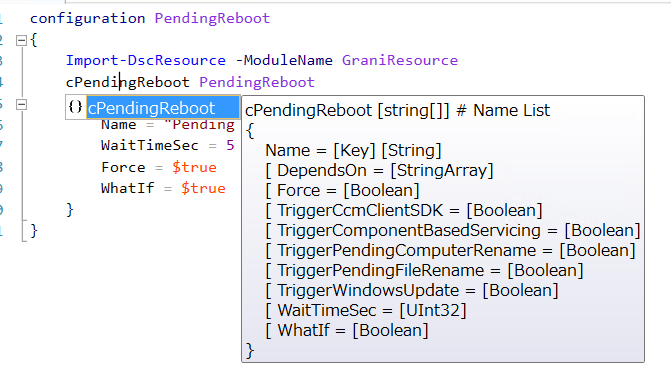

Grani_PendingReboot
============

DSC Resource to configure Schedule Task.

Resource Information
----

Name | FriendlyName | ModuleName 
-----|-----|-----
Grani_PendingReboot | cPendingReboot | GraniResource

Test Status
----

See GraniResource.Test for the detail.

Method | Result
----|----
Pester| pass
Configuration| pass
Get-DSCConfiguration| pass
Test-DSCConfiguration| pass

Intellisense
----



Sample
----

- None Reboot for ```RebootNodeIfREquired``` = $false, but will reboot for $true.
- This allow you to wait WaitTimeSec seconds before reboot.

```powershell
configuration PendingReboot
{
    Import-DscResource -ModuleName GraniResource
    cPendingReboot PendingReboot
    {
        Name = "Pending Reboot"
        WaitTimeSec = 5
        Force = $true
        WhatIf = $true
    }
}
```

- Both ```RebootNodeIfREquired``` = $false or $true will reboot.

```powershell
configuration PendingReboot
{
    Import-DscResource -ModuleName GraniResource
    cPendingReboot PendingReboot
    {
        Name = "Pending Reboot"
        WaitTimeSec = 5
        Force = $true
        WhatIf = $false
    }
}
```

- Skip PendingFileRenameRebootCheck with passing trigger as $false.

```powershell
configuration PendingReboot
{
    Import-DscResource -ModuleName GraniResource
    cPendingReboot PendingReboot
    {
        Name = "Pending Reboot"
        WaitTimeSec = 5
        Force = $true
        WhatIf = $true
        TriggerPendingFileRename = $false
    }
}
```

Tips
----

**Why this resource required?**

Because when you want to manage reboot under your control, there are no other option but using RebootNodeIfRequired = $falase in LocalConfigurationManager. However MSFT xPendingReboot requires to change LCM status before you apply configuration. (Need to run Set-DSCLocalConfigurationManager first.) This cause complex for user to handle reboot.

This resource will allow you manage reboot timing even if you set RebootNodeIfNeeded is $false.

**Control Trigger to reboot**

As there are Trigger properties, you can manage which trigger to use as Reboot.

TriggerName | Description
----|----
TriggerCcmClientSDK | Only for System Center.
TriggerComponentBasedServicing | When Windows Component was installed.
TriggerPendingComputerRename | When ComputerName was renamed. Not for Domain Join detection.
TriggerPendingFileRename | When Windows Update and KB File is waiting for reboot.
TriggerWindowsUpdate | When Windows update required reboot.

Make sure you can handle reboot preference for DomainJoin with cDomainJoin resource.