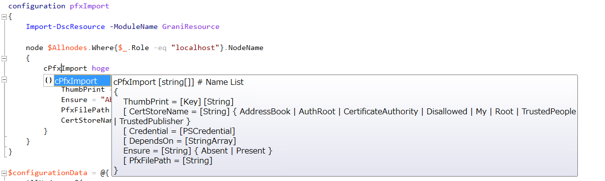

Grani_PfxImport
============

DSC Resource to Import pfx from file / Remove pfx from Cert.

Resource Information
----

Name | FriendlyName | ModuleName 
-----|-----|-----
Grani_PfxImport | cPfxImport | GraniResource

Test Status
----

See GraniResource.Test for the detail.

Method | Result
----|----
Pester| pass
Configuration| pass
Get-DSCConfiguration| pass
Test-DSCConfiguration| pass

Intellisense
----



Sample
----

**Import pfx**

- Import desired pfx from pfx file to Certificate Store.

```powershell
configuration pfxImport
{
    param
    (
        [PSCredential]$Credential
    )
    Import-DscResource -ModuleName GraniResource

    node $Allnodes.Where{$_.Role -eq "localhost"}.NodeName
    {
        cPfxImport hoge
        {
            ThumbPrint = "pfx thumbprint"
            Ensure = "Present"
            PfxFilePath = "c:\file\Path\To\Pfx\File"
            CertStoreName = "My"
            Credential = $Credential
        }
    }
}

$configurationData = @{
    AllNodes = @(
        @{
            NodeName = '*'
            PSDSCAllowPlainTextPassword = $true
        }
        @{
            NodeName = "localhost"
            Role     = "localhost"
        }
    )
}
```

**Remove pfx**

- Remove desired pfx from Certificate Store.

```powershell
configuration pfxImport
{
    Import-DscResource -ModuleName GraniResource

    node $Allnodes.Where{$_.Role -eq "localhost"}.NodeName
    {
        cPfxImport hoge
        {
            ThumbPrint = "pfx thumbprint"
            Ensure = "Absent"
            CertStoreName = "My"
        }
    }
}

$configurationData = @{
    AllNodes = @(
        @{
            NodeName = '*'
            PSDSCAllowPlainTextPassword = $true
        }
        @{
            NodeName = "localhost"
            Role     = "localhost"
        }
    )
}
```

Tips
----

**Only password authentication for pfx is valid.**

Make sure pfx is exported with Password authentication, not ADUser / ADGroup.

**Place your desired Pfx file before hand.**

If your certificate pfx is locating in s3 or anywhere, use cDownload or cS3Content to donwload it into node beforehand.