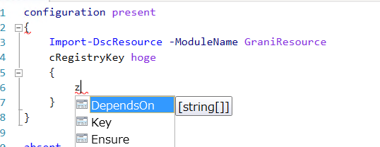

Grani_RegistryKey
============

DSC Resource to configure Registry SubKey.

Resource Information
----

Name | FriendlyName | ModuleName 
-----|-----|-----
Grani_RegistryKey | cRegistryKey | GraniResource

Test Status
----

See GraniResource.Test for the detail.

Method | Result
----|----
Pester| pass
Configuration| pass
Get-DSCConfiguration| pass
Test-DSCConfiguration| pass

Intellisense
----



Sample
----

- Add RegistryKey

this will add subkey name ```fuga/nyao``` and it's parent.

```powershell
configuration present
{
    Import-DscResource -ModuleName GraniResource
    cRegistryKey hoge
    {
        Key = "HKEY_LOCAL_MACHINE\SOFTWARE\hoge/piyo\fuga/nyao"
        Ensure = "Present"
    }    
}
```

- Remove RegistryKey

this will remove fuga/nyao subkey only. parent subkey tree will remain.

```powershell
configuration absent
{
    Import-DscResource -ModuleName GraniResource
    cRegistryKey hoge
    {
        Key = "HKEY_LOCAL_MACHINE\SOFTWARE\hoge/piyo\fuga/nyao"
        Ensure = "Absent"
    }    
}
```

Tips
----

**When do I need to use it?**

- Scene 1. Manage Registry SubKey only.

As MSFT_Registry never handle Registry SubKey, but it only handle Registry key/values. This resource will allow you to manage Registry SubKey where it doesn't exist for Regisry Value.

- Scene 2. Prevent MSFT_Registry Issue

As MSFT_Registy have issue with creating registry subkey which contains slash ```/```, like "HKEY_LOCAL_MACHINE\hoge/fuga\nyao". MSFT_Registry Resource will confuse ```/``` as path separater. It means MSFT_Registry resource understand that as "HKEY_LOCAL_MACHINE\hoge\fuga\nyao", oh.....

You will find it fixded issue with cRegistryKey resource.

Sample
----

You can configure Diffie-Hellman for TLS issue with DSC Configuration!

> [Guide to Deploying Diffie-Hellman for TLS](https://weakdh.org/sysadmin.html)

```powershell
configuration SSLPerfectForwardSecrecyTLS12
{
    Import-DscResource -ModuleName GraniResource

    #region Protcol Configuration

    # Disable Multi-Protocol Unified Hello
    Registry "DisableServerMultiProtocolUnifiedHello"
    {
        Key = "HKEY_LOCAL_MACHINE\System\CurrentControlSet\Control\SecurityProviders\SCHANNEL\Protocols\Multi-Protocol Unified Hello\Server"
        ValueName = "Enabled"
        ValueType = "Dword"
        ValueData = "0"
        Ensure = "Present"
        Force = $true
    }

    # Disable PCT1.0
    Registry "DisableServerPCT10"
    {
        Key = "HKEY_LOCAL_MACHINE\System\CurrentControlSet\Control\SecurityProviders\SCHANNEL\Protocols\PCT 1.0\Server"
        ValueName = "Enabled"
        ValueType = "Dword"
        ValueData = "0"
        Ensure = "Present"
        Force = $true
    }

    # Disable SSL 3.0 / 2.0
    $sslVersion = "SSL 3.0", "SSL 2.0"
    foreach ($x in $sslVersion)
    {
        $name = $x.Replace(".", "").Replace(" ","")
        Registry "DisableServer$name"
        {
            Key = "HKEY_LOCAL_MACHINE\System\CurrentControlSet\Control\SecurityProviders\SCHANNEL\Protocols\$x\Server"
            ValueName = "Enabled"
            ValueType = "Dword"
            ValueData = "0"
            Ensure = "Present"
            Force = $true
        }
    }

    # Add TLS 1.0 / 1.1 / 1.2
    $tlsVersion = "TLS 1.0", "TLS 1.1", "TLS 1.2"
    foreach ($x in $tlsVersion)
    {
        $name = $x.Replace(".", "").Replace(" ","")
        Registry "EnableServer$name"
        {
            Key = "HKEY_LOCAL_MACHINE\System\CurrentControlSet\Control\SecurityProviders\SCHANNEL\Protocols\$x\Server"
            ValueName = "Enabled"
            ValueType = "Dword"
            ValueData = "0xffffffff"
            Ensure = "Present"
            Hex = $true
            Force = $true
        }

        Registry "EnableByDefaultServer$name"
        {
            Key = "HKEY_LOCAL_MACHINE\System\CurrentControlSet\Control\SecurityProviders\SCHANNEL\Protocols\$x\Server"
            ValueName = "DisabledByDefault"
            ValueType = "Dword"
            ValueData = "0"
            Ensure = "Present"
            Force = $true
        }

        Registry "EnableClient$name"
        {
            Key = "HKEY_LOCAL_MACHINE\System\CurrentControlSet\Control\SecurityProviders\SCHANNEL\Protocols\$x\Client"
            ValueName = "Enabled"
            ValueType = "Dword"
            ValueData = "0xffffffff"
            Ensure = "Present"
            Hex = $true
            Force = $true
        }

        Registry "EnableByDefaultClient$name"
        {
            Key = "HKEY_LOCAL_MACHINE\System\CurrentControlSet\Control\SecurityProviders\SCHANNEL\Protocols\$x\Client"
            ValueName = "DisabledByDefault"
            ValueType = "Dword"
            ValueData = "0"
            Ensure = "Present"
            Force = $true
        }
    }

    #endregion

    #region Cipher Configuration

    # Disable insecure Ciphers
    $insecureCiphers = 'DES 56/56', 'NULL', 'RC2 128/128', 'RC2 40/128', 'RC2 56/128', 'RC4 40/128', 'RC4 56/128', 'RC4 64/128', 'RC4 128/128'
    foreach ($x in $insecureCiphers)
    {
        $name = $x.Replace(" ", "").Replace('/', '')

        cRegistryKey "KeyDisableCipher$name"
        {
            Key = "HKEY_LOCAL_MACHINE\SYSTEM\CurrentControlSet\Control\SecurityProviders\SCHANNEL\Ciphers\$x"
            Ensure = "Present"
        }

        Registry "DisableCipher$name"
        {
            Key = "HKEY_LOCAL_MACHINE\SYSTEM\CurrentControlSet\Control\SecurityProviders\SCHANNEL\Ciphers\$x"
            ValueName = "Enabled"
            ValueType = "Dword"
            ValueData = "0"
            Ensure = "Present"
            Force = $true
        }        
    }

    # Enable secure Ciphers
    $secureCiphers =  'AES 128/128', 'AES 256/256', 'Triple DES 168/168'
    foreach ($x in $secureCiphers)
    {
        $name = $x.Replace(" ", "").Replace('/', '')

        cRegistryKey "KeyEnableCipher$name"
        {
            Key = "HKEY_LOCAL_MACHINE\SYSTEM\CurrentControlSet\Control\SecurityProviders\SCHANNEL\Ciphers\$x"
            Ensure = "Present"
        }

        Registry "EnableCipher$name"
        {
            Key = "HKEY_LOCAL_MACHINE\SYSTEM\CurrentControlSet\Control\SecurityProviders\SCHANNEL\Ciphers\$x"
            ValueName = "Enabled"
            ValueType = "Dword"
            ValueData = "0xffffffff"
            Ensure = "Present"
            Hex = $true
            Force = $true
        }        
    }

    #endregion

    #region Hash Configuration

    # Disable MD5
    $hashMD5 = 'MD5'
    Registry "DisableHash$hashMD5"
    {
        Key = "HKEY_LOCAL_MACHINE\SYSTEM\CurrentControlSet\Control\SecurityProviders\SCHANNEL\Hashes\$hashMD5"
        ValueName = "Enabled"
        ValueType = "Dword"
        ValueData = "0"
        Ensure = "Present"
        Force = $true
    }        

    # Enable SHA
    $hashSHA = "SHA"
    Registry "DisableHash$hashSHA"
    {
        Key = "HKEY_LOCAL_MACHINE\SYSTEM\CurrentControlSet\Control\SecurityProviders\SCHANNEL\Hashes\$hashSHA"
        ValueName = "Enabled"
        ValueType = "Dword"
        ValueData = "0xffffffff"
        Ensure = "Present"
        Hex = $true
        Force = $true
    }        

    #endregion

    #region KeyExchangeAlgorithm Configuration

    # Enable Diffie-Hellman / PKCS
    $keyExchangeAlgorithm = "Diffie-Hellman", "PKCS"
    foreach ($x in $keyExchangeAlgorithm)
    {
        $name = $x.Replace("-", "")
        Registry "EnableKeyAlgorithm$name"
        {
            Key = "HKEY_LOCAL_MACHINE\SYSTEM\CurrentControlSet\Control\SecurityProviders\SCHANNEL\KeyExchangeAlgorithms\$x"
            ValueName = "Enabled"
            ValueType = "Dword"
            ValueData = "0xffffffff"
            Ensure = "Present"
            Hex = $true
            Force = $true
        }
    }

    #endregion

    #region Cipher Suite Configuration (Enables Perfect Forward Secrecy)

    $cipherSuitesOrder = @(
      'TLS_ECDHE_RSA_WITH_AES_256_CBC_SHA384_P521',
      'TLS_ECDHE_RSA_WITH_AES_256_CBC_SHA384_P384',
      'TLS_ECDHE_RSA_WITH_AES_256_CBC_SHA384_P256',
      'TLS_ECDHE_RSA_WITH_AES_256_CBC_SHA_P521',
      'TLS_ECDHE_RSA_WITH_AES_256_CBC_SHA_P384',
      'TLS_ECDHE_RSA_WITH_AES_256_CBC_SHA_P256',
      'TLS_ECDHE_RSA_WITH_AES_128_CBC_SHA256_P521',
      'TLS_ECDHE_RSA_WITH_AES_128_CBC_SHA_P521',
      'TLS_ECDHE_RSA_WITH_AES_128_CBC_SHA256_P384',
      'TLS_ECDHE_RSA_WITH_AES_128_CBC_SHA256_P256',
      'TLS_ECDHE_RSA_WITH_AES_128_CBC_SHA_P384',
      'TLS_ECDHE_RSA_WITH_AES_128_CBC_SHA_P256',
      'TLS_ECDHE_ECDSA_WITH_AES_256_GCM_SHA384_P521',
      'TLS_ECDHE_ECDSA_WITH_AES_256_GCM_SHA384_P384',
      'TLS_ECDHE_ECDSA_WITH_AES_128_GCM_SHA256_P521',
      'TLS_ECDHE_ECDSA_WITH_AES_128_GCM_SHA256_P384',
      'TLS_ECDHE_ECDSA_WITH_AES_128_GCM_SHA256_P256',
      'TLS_ECDHE_ECDSA_WITH_AES_256_CBC_SHA384_P521',
      'TLS_ECDHE_ECDSA_WITH_AES_256_CBC_SHA384_P384',
      'TLS_ECDHE_ECDSA_WITH_AES_256_CBC_SHA_P521',
      'TLS_ECDHE_ECDSA_WITH_AES_256_CBC_SHA_P384',
      'TLS_ECDHE_ECDSA_WITH_AES_256_CBC_SHA_P256',
      'TLS_ECDHE_ECDSA_WITH_AES_128_CBC_SHA256_P521',
      'TLS_ECDHE_ECDSA_WITH_AES_128_CBC_SHA256_P384',
      'TLS_ECDHE_ECDSA_WITH_AES_128_CBC_SHA256_P256',
      'TLS_ECDHE_ECDSA_WITH_AES_128_CBC_SHA_P521',
      'TLS_ECDHE_ECDSA_WITH_AES_128_CBC_SHA_P384',
      'TLS_ECDHE_ECDSA_WITH_AES_128_CBC_SHA_P256',
      'TLS_DHE_DSS_WITH_AES_256_CBC_SHA256',
      'TLS_DHE_DSS_WITH_AES_256_CBC_SHA',
      'TLS_DHE_DSS_WITH_AES_128_CBC_SHA256',
      'TLS_DHE_DSS_WITH_AES_128_CBC_SHA',
      'TLS_DHE_DSS_WITH_3DES_EDE_CBC_SHA'
    )
    $cipherSuitesAsString = [string]::join(',', $cipherSuitesOrder)
    Registry "EnableCipherSuiteOrder"
    {
        Key = "HKEY_LOCAL_MACHINE\SOFTWARE\Policies\Microsoft\Cryptography\Configuration\SSL\00010002"
        ValueName = "Functions"
        ValueType = "String"
        ValueData = $cipherSuitesAsString
        Ensure = "Present"
        Force = $true
    }

    #endregion    
}
```