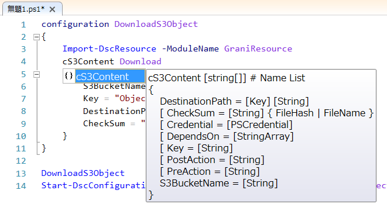

Grani_S3Content
============

DSC Resource to download content from S3.

Resource Information
----

Name | FriendlyName | ModuleName 
-----|-----|-----
Grani_S3Content | cS3Content | GraniResource

Test Status
----

See GraniResource.Test for the detail.

Method | Result
----|----
Pester| pass
Configuration| pass
Get-DSCConfiguration| pass
Test-DSCConfiguration| pass

Intellisense
----




Sample
----

- Download S3Object from Desired S3Bucket.

Checking LocalFileHash and s3Content ETag Hash is equal. (CheckSum = "FileHash")  

```powershell
configuration DownloadS3Object
{
    Import-DscResource -ModuleName GraniResource
    cS3Content Download
    {
        S3BucketName = "YourBucketName"
        Key = "ObjectName"
        DestinationPath = "c:\Path\To\Save\Content"
    }
}
```

Checking only DestinationPath is exist. It means not verifying filehash, but only checking FileName (CheckSum = "FileName")  

```powershell
configuration DownloadS3Object
{
    Import-DscResource -ModuleName GraniResource
    cS3Content Download
    {
        S3BucketName = "YourBucketName"
        Key = "ObjectName"
        DestinationPath = "c:\Path\To\Save\Content"
        CheckSum = "FileName"
    }
}
```


- Download S3Object from Desired S3Bucket with Execute PreAction and PostAction of Download.

This sample shows how to run PreAction for Download, and PostAction for Download.
You may find Stanrd Output with Debug mode.

```powershell
configuration DownloadS3Object
{
    Import-DscResource -ModuleName GraniResource
    cS3Content Download
    {
        S3BucketName = "YourBucketName"
        Key = "ObjectName"
        DestinationPath = "c:\Path\To\Save\Content"
        PreAction = {"PreAction : {0}" -f (Get-Date)}
        PostAction = {"PostAction : {0}" -f (Get-Date)}
    }
}
```

Dependancy
----

- [AWSpowerShell](http://aws.amazon.com/powershell/) 

You will find it already install by default at Windows EC2 Instance.

- [IAM Role](http://docs.aws.amazon.com/AWSEC2/latest/UserGuide/iam-roles-for-amazon-ec2.html)

This is the best standard for AWS. Don't manage credential by your own, but pass it to IAM.

When IAM Role is attached to your instance, S3 Bucket policy can control Where / What / How to access it's object.

Tips
----

**FileHash and ETag maching**

In default, S3Conten matching MD5 file hash and Etag on S3 for file version validation. However S3 content Etag (MD5) will be changed when content upload by MultiPart Upload. This cause unmatching of MD5 FileHash between S3 Content and Downloaded File.

Therefore you can use following function to upload content to s3 by SinglePart upload.

MultiPart Upload will be automatically use with over 10MB content by both ```Write-S3Object``` in AWSPowerShell and WebConsole direct put.

```powershell
function Write-S3ObjectSinglePart
{
    [OutputType([Void])]
    [CmdletBinding()]
    param
    (
        [parameter(Mandatory = $true, Position = 0)]
        [string]$BucketName,
        
        [parameter(Mandatory = $true, Position = 1)]
        [string]$Key,
        
        [parameter(Mandatory = $true, Position = 2)]
        [string]$FilePath,

        [parameter(Mandatory = $false, Position = 3)]
        [Amazon.RegionEndpoint]$Endpoint = [Amazon.RegionEndpoint]::APNortheast1
    )

    begin
    {
        function WriteAnObject ([Amazon.S3.AmazonS3Client]$Client)
        {
            $putObjectRequest = New-Object Amazon.S3.Model.PutObjectRequest
            $putObjectRequest.BucketName = $BucketName
            $putObjectRequest.Key = $Key
            $putObjectRequest.FilePath = $FilePath
            [Amazon.S3.Model.PutObjectResponse]$responce = $Client.PutObject($putObjectRequest)
        }
    }

    end
    {
        try
        {
            $client = New-Object Amazon.S3.AmazonS3Client ($Endpoint)
            WriteAnObject -Client $client
        }
        finally
        {
            $client.Dispose()
        }
    }
}
``` 

If you want not validate FileHash but only with FileName, then use ```CheckSum``` property as "FileName". 