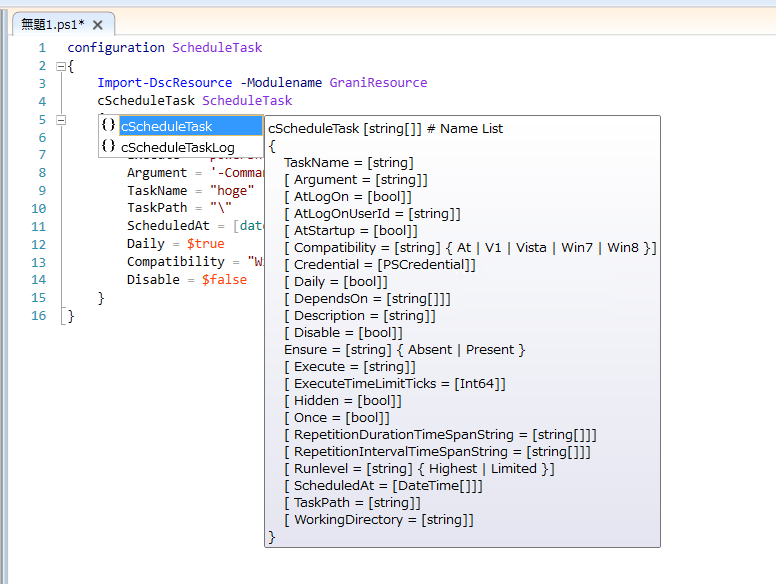

Grani_ScheduleTask
============

DSC Resource to configure Schedule Task.

Resource Information
----

Name | FriendlyName | ModuleName
-----|-----|-----
Grani_ScheduleTask | cScheduleTask | GraniResource

Test Status
----

See GraniResource.Test for the detail.

Method | Result
----|----
Pester| pass
Configuration| pass
Get-DSCConfiguration| pass
Test-DSCConfiguration| pass

Intellisense
----



Sample
----

**Note : Default RepetitionInterval and RepetitionDuration are already sat.

- Create ScheduleTask with SYSTEM account.

```powershell
configuration ScheduleTask
{
    Import-DscResource -Modulename GraniResource
    cScheduleTask ScheduleTask
    {
        Ensure = "Present"
        Execute = "powershell.exe"
        Argument = '-Command "Get-Date | Out-File c:\hoge.log"'
        TaskName = "hoge"
        TaskPath = "\"
        ScheduledAt = [datetime]"00:00:00"
        Daily = $true
        Compatibility = "Win8"
        Disable = $false
    }
}
```

- Create Daily ScheduleTask with Specific account.

```powershell
configuration ScheduleTask
{
    param([PSCredential]$Credential)
    Import-DscResource -Modulename GraniResource
    Node $AllNodes.Where{$_.Role -eq "localhost"}.NodeName
    {
        cScheduleTask ScheduleTask
        {
            Ensure = "Present"
            Execute = "powershell.exe"
            Argument = '-Command "Get-Date | Out-File c:\hoge.log"'
            TaskName = "hoge"
            TaskPath = "\"
            ScheduledAt = [datetime]"00:00:00"
            Daily = $true
            Compatibility = "Win8"
            Disable = $false
            Credential = $Credential
        }
    }
}

$ConfigurationData = @{
    Allnodes = @(
        @{
            NodeName = "*"
            PSDscAllowPlainTextPassword = $true
        }
        @{
            NodeName ="localhost"
            Role = "localhost"
        }
    )
}
```

- Create ScheduleTask with Repetition.

```powershell
configuration ScheduleTask
{
    Import-DscResource -Modulename GraniResource
    cScheduleTask ScheduleTask
    {
        Ensure = "Present"
        Execute = "powershell.exe"
        Argument = '-Command "Get-Date | Out-File c:\hoge.log"'
        TaskName = "hoge"
        TaskPath = "\"
        ScheduledAt = @([datetime]"00:00:00")
        RepetitionIntervalTimeSpanString = @([TimeSpan]::FromHours(1).ToString()),
        RepetitionDurationTimeSpanString = @([TimeSpan]::MaxValue.ToString()),
        Compatibility = "Win8"
        Disable = $false
    }
}
```

- Create ScheduleTask with AtStartup.

```powershell
configuration ScheduleTask
{
    Import-DscResource -Modulename GraniResource
    cScheduleTask ScheduleTask
    {
        Ensure = "Present"
        Execute = "powershell.exe"
        Argument = '-Command "Get-Date | Out-File c:\hoge.log"'
        TaskName = "hoge"
        TaskPath = "\"
        AtStartup = $true
        Compatibility = "Win8"
        Disable = $false
    }
}
```

- Create ScheduleTask with AtLogOn. This configuration will run any user who log on.

```powershell
configuration ScheduleTask
{
    Import-DscResource -Modulename GraniResource
    cScheduleTask ScheduleTask
    {
        Ensure = "Present"
        Execute = "powershell.exe"
        Argument = '-Command "Get-Date | Out-File c:\hoge.log"'
        TaskName = "hoge"
        TaskPath = "\"
        AtLogon = $true
        Compatibility = "Win8"
        Disable = $false
    }
}
```

Set Specific user to run with AtLogOn.

```powershell
configuration ScheduleTask
{
    Import-DscResource -Modulename GraniResource
    cScheduleTask ScheduleTask
    {
        Ensure = "Present"
        Execute = "powershell.exe"
        Argument = '-Command "Get-Date | Out-File c:\hoge.log"'
        TaskName = "hoge"
        TaskPath = "\"
        AtLogon = $true
        AtLogOnUserId = "test"
        Compatibility = "Win8"
        Credential = $Credential
        Disable = $false
    }
}
```

- Remove ScheduleTask.

```powershell
configuration ScheduleTask
{
    Import-DscResource -Modulename GraniResource
    cScheduleTask ScheduleTask
    {
        Ensure = "Absent"
        TaskName = "hoge"
        TaskPath = "\"
        Disable = $false
    }
}
```
- Remove ScheduleTask.

```powershell
configuration ScheduleTask
{
    Import-DscResource -Modulename GraniResource
    cScheduleTask ScheduleTask
    {
        Ensure = "Absent"
        TaskName = "hoge"
        TaskPath = "\"
        Disable = $false
    }
}
```


Tips
----

**Work on specific user**

If you didn't specify Credential Property, resource creates schedule task as SYSTEM account.

You can set ScheduledTask with Specific UserAccount, only when you passed Valid user account. Otherwise you will get following errors.

```
完全修飾エラー ID は HRESULT 0x80070534,Register-ScheduledTask です。エラー メッセージは アカウント名とセキュリティ ID の間のマッピングは実行されませんでした。
```

```
no mapping between account names and security IDs was done. (Exception from HRESULT:0x80070534)
```

**For below ver.3.7.5 users**

There are First Char, Last Char fpr TaskPath from ver.3.7.6.
However previous version only check Last Char.

If you are using ver.3.7.5 or below, then first char of TaskPath must be  ```\```.

For example, following is pass.

```powershell
configuration ScheduleTask
{
    Import-DscResource -Modulename GraniResource
    cScheduleTask ScheduleTask
    {
        Ensure = "Present"
        Execute = "powershell.exe"
        Argument = '-Command "Get-Date | Out-File c:\hoge.log"'
        TaskName = "hoge"
        TaskPath = "\hoge"
        AtLogon = $true
        AtLogOnUserId = "test"
        Compatibility = "Win8"
        Credential = $Credential
        Disable = $false
    }
}
```

While below will always failed for Test, and run Set everytime.

```powershell
configuration ScheduleTask
{
    Import-DscResource -Modulename GraniResource
    cScheduleTask ScheduleTask
    {
        Ensure = "Present"
        Execute = "powershell.exe"
        Argument = '-Command "Get-Date | Out-File c:\hoge.log"'
        TaskName = "hoge"
        TaskPath = "hoge" # Don't do this.
        AtLogon = $true
        AtLogOnUserId = "test"
        Compatibility = "Win8"
        Credential = $Credential
        Disable = $false
    }
}
```
