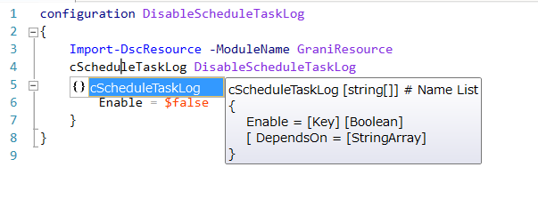

Grani_ScheduleTaskLog
============

DSC Resource to configure Schedule Task Log enable/disable.

Resource Information
----

Name | FriendlyName | ModuleName 
-----|-----|-----
Grani_ScheduleTaskLog | cScheduleTaskLog | GraniResource

Test Status
----

See GraniResource.Test for the detail.

Method | Result
----|----
Pester| not yet
Configuration| pass
Get-DSCConfiguration| pass
Test-DSCConfiguration| pass

Intellisense
----



Sample
----

- Disable Schedule Task Log.

```powershell
configuration DisableScheduleTaskLog
{
    Import-DscResource -ModuleName GraniResource
    cScheduleTaskLog DisableScheduleTaskLog
    {
        Enable = $false
    }
}
```
