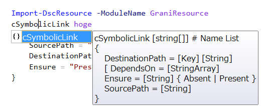

Grani_SymbolicLink
============

DSC Resource to configure SymbolicLink.

Resource Information
----

Name | FriendlyName | ModuleName 
-----|-----|-----
Grani_SymbolicLink | cSymbolicLink | GraniResource

Test Status
----

See GraniResource.Test for the detail.

Method | Result
----|----
Pester| pass
Configuration| pass
Get-DSCConfiguration| pass
Test-DSCConfiguration| pass

Intellisense
----



Sample
----

- Create Symbolic Link.

```powershell
configuration present
{
    Import-DscResource -ModuleName GraniResource
    cSymbolicLink hoge
    {
        SourcePath = "C:\Logs\DSC"
        DestinationPath = "C:\DSC"
        Ensure = "Present"
    }
}
```

- Remove Symbolic Link.

```powershell
configuration absent
{
    Import-DscResource -ModuleName GraniResource
    cSymbolicLink hoge
    {
        SourcePath = "C:\Logs\DSC"
        DestinationPath = "C:\DSC"
        Ensure = "Absent"
    }
}
```

Tips
----

**SourcePath must exist beforehand.**

In this Resource, Source Path must exist before configuration apply to the node.