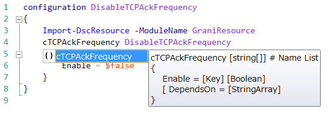

Grani_TCPAckFrequency
============

DSC Resource to configure TCPAckFrequency.

Resource Information
----

Name | FriendlyName | ModuleName 
-----|-----|-----
Grani_TCPAckFrequency | cTCPAckFrequency | GraniResource

Test Status
----

See GraniResource.Test for the detail.

Method | Result
----|----
Pester| pass
Configuration| pass
Get-DSCConfiguration| pass
Test-DSCConfiguration| pass

Intellisense
----



Sample
----

- Disable TCP Ack Frequency. You need restart computer to apply configuration.

```powershell
configuration DisableTCPAckFrequency
{
    Import-DscResource -ModuleName GraniResource
    cTCPAckFrequency DisableTCPAckFrequency
    {
        Enable = $false
    }
}
```
