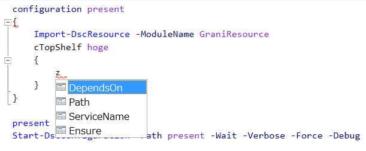

Grani_TopShelf
============

DSC Resource to configure TopShelf Service.

Resource Information
----

Name | FriendlyName | ModuleName 
-----|-----|-----
Grani_TopShelf | cTopShelf | GraniResource

Test Status
----

See GraniResource.Test for the detail.

Method | Result
----|----
Pester| pass
Configuration| pass
Get-DSCConfiguration| pass
Test-DSCConfiguration| pass

Intellisense
----



Sample
----

- Install TopShelf Service

```powershell
configuration present
{
    Import-DscResource -ModuleName GraniResource
    cTopShelf hoge
    {
        ServiceName = "SampleTopShelfService"
        Path = (Resolve-Path ".\SampleTopShelfService\SampleTopShelfService\bin\Debug\SampleTopShelfService.exe").Path
        Ensure = "Present"
    }
}
```

- Uninstall TopShelf Service

```powershell
configuration absent
{
    Import-DscResource -ModuleName GraniResource
    cTopShelf hoge
    {
        ServiceName = "SampleTopShelfService"
        Path = (Resolve-Path ".\SampleTopShelfService\SampleTopShelfService\bin\Debug\SampleTopShelfService.exe").Path
        Ensure = "Absent"
    }
}
```

Tips
----

**TopShelf build items must exist before hand.**

In this Resource, Path must exist before configuration apply to the node.

**TopShelf Service status will not manage with this service.**

This resource only install/uninstall service. Thus you need to manage service status with MSFT_Service Resource.

**ProcessName Should be same as exe name.**

This resource identify Service Process name as Service.exe name.

**Update TopShelf automaticaty**

With cS3Content resource, you can automate update. 

1. There are PreAction with cS3Content Set execution. Do stop service at that stage will enable you to remove handle from TopShelf .dll and .exe. (You may able to delete items or overwritethem)
2. If TopShelf service is downloaded as .zip, then use Archive Resource to extract them and overwrite existing.
3. Use cTopShelf Resource to promise service installed in to node.
4. Run Service Resource to Promise Service started successfully.

Here's sample DSC Configuration.

```powershell
configuration SampleTopShelfContinuousDelivery
{
    $s3Bucket = "INPUT YOUR S3 BUCKET NAME"

    $zip = "S3 KEY ZIP FILE NAME"
	$exe = "SERVICE EXE NAME"
    $serviceName = "SERVICE NAME DEFINED IN TOPSHELF"

    $destination = "C:\DOWNLOADPATH"
    $downloadPath = Join-Path $destination $zip
    $unzipPath = Join-Path $destination $serviceName
    $servicePath = Join-Path $unzipPath "MSBUILD\EXTRACT\PATH\TO\$exe"

    Import-DSCResource -ModuleName GraniResource

    cS3Content SampleTopShelfContinuousDelivery
    {
        S3BucketName = $s3Bucket
        Key = $zip
        DestinationPath = $downloadPath
        PreAction =  {
            Stop-Service $using:serviceName
            Remove-Item -Path $using:unzipPath -Recurse -Force
        }
    }

    Archive SampleTopShelfContinuousDelivery
    {
        Ensure = 'Present'
        Path = $downloadPath
        Destination = $unzipPath
    }

    cTopShelf SampleTopShelfContinuousDelivery
    {
        Ensure = "Present"
        Path = $servicePath
        ServiceName = $serviceName
    }

    Service SampleTopShelfContinuousDelivery
    {
        Name = $serviceName
        State = 'Running'
    }
}
```