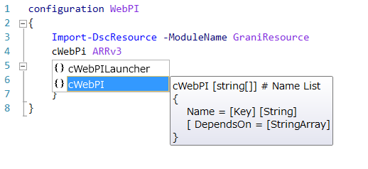

Grani_WebPI
============

DSC Resource to configure Web Platform Installer Packages.

Resource Information
----

Name | FriendlyName | ModuleName 
-----|-----|-----
Grani_WebPI | cWebPI | GraniResource

Test Status
----

See GraniResource.Test for the detail.

Method | Result
----|----
Pester| pass
Configuration| pass
Get-DSCConfiguration| pass
Test-DSCConfiguration| pass

Intellisense
----



Sample
----

- Install Web Platform Version 5

```powershell
configuration WebPILauncherInstall
{
    Import-DscResource -ModuleName GraniResource
    cWebPILauncher Installv5
    {
        ProductId = "4D84C195-86F0-4B34-8FDE-4A17EB41306A"
    }
}
```

Tips
----

Web Platform Installer never offer unistall method. This module only manage installation status.