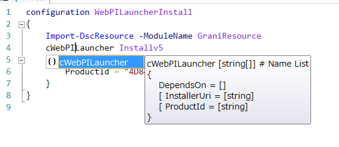

cWebPILauncher
============

Composite DSC Resource to configure Web Platform Installater.

Resource Information
----

Name | FriendlyName | ModuleName 
-----|-----|-----
cWebPILauncher | cWebPILauncher | GraniResource

Test Status
----

See GraniResource.Test for the detail.

Method | Result
----|----
Pester| not yet
Configuration| pass
Get-DSCConfiguration| pass
Test-DSCConfiguration| pass

Intellisense
----



Sample
----

- Web Platform Installer v5. (default uri)

```powershell
configuration WebPI
{
    Import-DscResource -ModuleName GraniResource
    cWebPi ARRv3
    {
        Name = 'ARRv3_0'
    }
}
```

Tips
----

Make sure ProductId is valid for Installer Uri msi. Default Installer uri is WebPI v5.