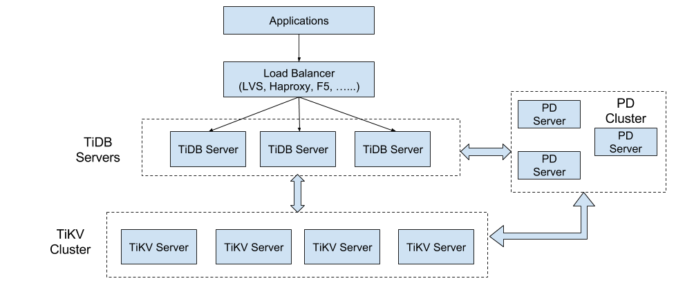

# Deploy a TiDB cluster on CentOS virtual machines

<a href="https://portal.azure.com/#create/Microsoft.Template/uri/https%3A%2F%2Fraw.githubusercontent.com%2FAzure%2Fazure-quickstart-templates%2Fmaster%2Ftidb-cluster-on-centos%2Fazuredeploy.json" target="_blank">
  
</a>
<a href="http://armviz.io/#/?load=https%3A%2F%2Fraw.githubusercontent.com%2FAzure%2Fazure-quickstart-templates%2Fmaster%2Ftidb-cluster-on-centos%2Fazuredeploy.json" target="_blank">
  
</a>

This template deploys a TiDB cluster on the CentOS virtual machines. This template also provisions a storage account, virtual network, network security groups, availability sets, load balancer, public IP addresses and network interfaces required by the installation. The template also creates 1 publicly accessible VM acting as a "monitor server" and "jumpbox" allowing to ssh into the PD/TiKV/TiDB nodes for diagnostics or troubleshooting purposes. In addition, and created a load balancer for TiDB servers so that users can connect to the database through this.

The template expects the following parameters:

| Name   | Description | Default Value |
|:--- |:---|:---|
| adminUsername  | Administrator user name used when provisioning virtual machines | tidb |
| adminPassword  | Administrator password used when provisioning virtual machines | |
| storageAccountNamePrefix | Unique namespace for the Storage Account where the Virtual Machine's disks will be placed (this name will be used as a prefix to create three storage accounts for PD/Monitor/TiDB/TiKV) | |
| virtualNetworkName | The arbitrary name of the virtual network provisioned for the tidb cluster deployment | tidbclusterVnet |
| environment | Location where resources will be provisioned |AzureCloud|
| tidbVersion | The version of the TiDB packages to be deployed | latest |
| pdCount | Number of PD VMs in the cluster | 3 |
| pdVmSize | The VM size of the pd deployment | `Standard_A2_v2` |
| tidbCount | Number of TiDB VMs in the cluster | 2 |
| tidbVmSize | The VM size of the tidb deployment | `Standard_A4_v2` |
| tikvCount | Number of TiKV VMs in the cluster | 3 |
| tikvVmSize | The VM size of the tikv deployment | `Standard_D12_v2` |
| monitorVmSize | The VM size of the monitor deployment | `Standard_A3` |


## TiDB architecture
To better understand TiDB’s features, you need to understand the TiDB architecture.



The TiDB cluster has three components: the TiDB server, the PD server, and the TiKV server. More detailed information can be found [here](https://github.com/pingcap/docs).

## Topology

The following table outlines the deployment topology characteristics for default setting:


| components | Member Node VM Size | CPU Cores | Memory | Data Disks | # of Members | # of Storage Accounts |
|:--- |:---|:---|:---|:---|:---|:---|
| pd | `Standard_A2_v2` | 2 | 4 GB | 20 GB SSD  | 3 | 3 |
| tikv | `Standard_D12_v2` | 4 | 28 GB | 300 GB SSD | 3 | 3 |
| tidb | `Standard_A4_v2` | 4 | 8 GB | 40 GB SSD  | 2 | 3 |
| monitor | `Standard_A3` | 4 | 7 GB | 285 GB HDD | 1 | 3 |

When the deployment is completed, you can access tidb cluster's monitor by following steps.

```bash
# get monitor address
echo http://$(az network public-ip list -g test-tidb --query "[?name=='pubip-monitor'].dnsSettings.fqdn" -otsv):3000

# grafana login user name and password
username: admin
password: admin
```
And you can access tidb server by loadBalancer ip.

```bash
tidb_lb_ip=$(az network public-ip list -g test-tidb --query "[?name=='tidb-lb-pubip'].ipAddress" -otsv)

# login tidb server
mysql -uroot -h${tidb_lb_ip} -P4000
```
