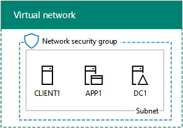

# TLG (Test Lab Guide) 3 VM Base Configuration

This template deploys the **TLG (Test Lab Guide) 3 VM Base Configuration**, a Test Lab Guide (TLG) configuration that represents a simplified intranet connected 
to the Internet. This base configuration is the starting point for additional TLGs that can be found [here](http://aka.ms/catlgs).

The **TLG (Test Lab Guide) 3 VM Base Configuration** provisions a Windows Server 2012 R2 Active Directory domain controller using the specified domain name, 
an application server running Windows Server 2012 R2, and optionally a client VM running Windows 10. 

**Note:** If you choose to deploy a client VM, you must upload a generalized Windows 10 VHD to an Azure storage account and provide the account name and SAS token. 
This is because the Windows 10 gallery image is only available in eligible subscriptions (Visual Studio or MSDN). The path to the VHD should be
like the following:

     https://<storage account name>.blob.core.windows.net/vhds/<vhdName>.VHD
* For more information about eligible subscriptions, see https://docs.microsoft.com/en-us/azure/virtual-machines/windows/client-images#subscription-eligibility.
* For more information about how to prepare a generalized VHD, see https://docs.microsoft.com/en-us/azure/virtual-machines/windows/prepare-for-upload-vhd-image.

## Credits
Thanks to both Simon Davies and Willem Kasdorp, from whom I borrowed various DSC configuration elements.

## Solution overview and deployed resources

The following resources are deployed as part of the solution:

+ **ADDC VM**: Windows Server 2012 R2 VM configured as a domain controller and DNS with static private IP address
+ **App Server VM**: Windows Server 2012 R2 VM joined to the domain
+ **Client VM**: Windows 10 client joined to the domain
+ **NSG**: Network security group configured to allow inbound RDP on 3389
+ **Virtual network**: Virtual network for internal traffic, configured with custom DNS pointing to the ADDC's private IP address
+ **Network interfaces**: 1 NIC per VM
+ **Public IP addresses**: 1 public IP per VM
+ **Storage accounts**: 2 storage accounts for VHDs and diagnostics respectively
+ **JoinDomain**: Each member VM uses the **JsonADDomainExtension** extension to join the domain.
+ **BGInfo**: The **BGInfo** extension is applied to all VMs.
+ **Antimalware**: The **iaaSAntimalware** extension is applied to all VMs with basic scheduled scan and exclusion settings.

## Solution notes

* The *App server* and *Client* VM resources depend on the **ADDC** resource deployment to ensure that the AD domain exists prior to execution of 
the JoinDomain extensions. The asymmetric VM deployment adds a few minutes to the overall deployment time.
* The private IP address of the **ADDC** VM is always *10.0.0.10*. This IP is set as the DNS IP for the virtual network and all member NICs.
* The default VM size for all VMs in the deployment is Standard_D2_v2.
* Deployment outputs include public IP address and FQDN for each VM.

`Tags: TLG, Test Lab Guide, Base Configuration`
___
Developed by the **MAX Skunkworks Lab**  
Author: Kelley Vice (kvice@microsoft.com)  
https://github.com/maxskunkworks

