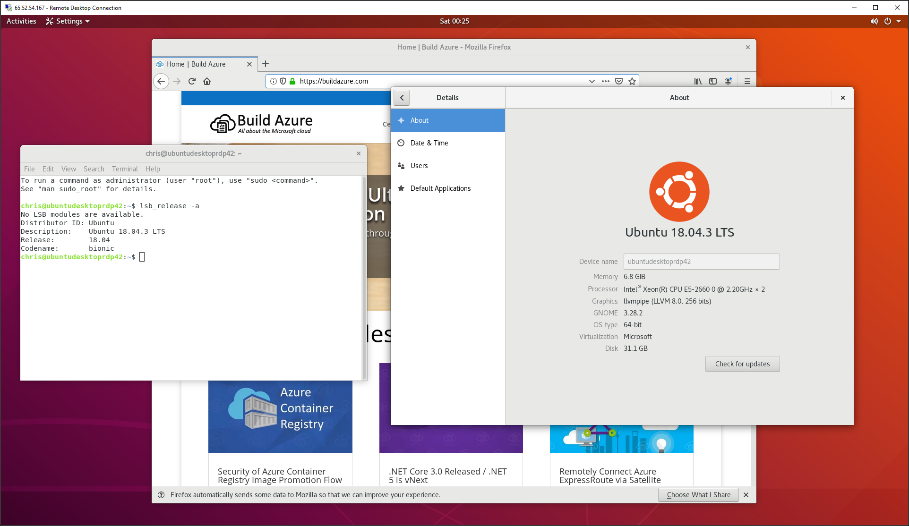

# Deploy Ubuntu Desktop VM with RDP support

&nbsp;
&nbsp;

&nbsp;
&nbsp;

&nbsp;
&nbsp;

This template deploys an Ubuntu Server VM, then uses the Linux CustomScript extension to install the Ubuntu Gnome Desktop and Remote Desktop support (via xrdp). The final provisioned Ubuntu VM support remote connections over RDP; just like you can with a Windows machine.

Once you connect remotely to the Ubuntu VM over RDP, you will see a similar experience as if you were sitting at an Ubuntu Desktop machine.

Here's a sample screenshot of an RDP session connecting to the Ubuntu VM:

When connected over RDP, the VM will prompt you a few times for the Password for the VM. If you wish to remove these prompts for future use of the VM, then follow the instructions at this link: <https://askubuntu.com/questions/675379/how-to-disable-the-password-prompts>

When connected over RDP to the VM the first time, it will prompt for password a couple times. If/when prompted for the Password for a user named `Ubuntu` this first time connecting, simply select "Cancel" and the prompt will go away. Once Ubuntu is configured and able to be used to run apps and other things, then the admin password for the VM will be the password for the `Ubuntu` user it will prompt for later.
