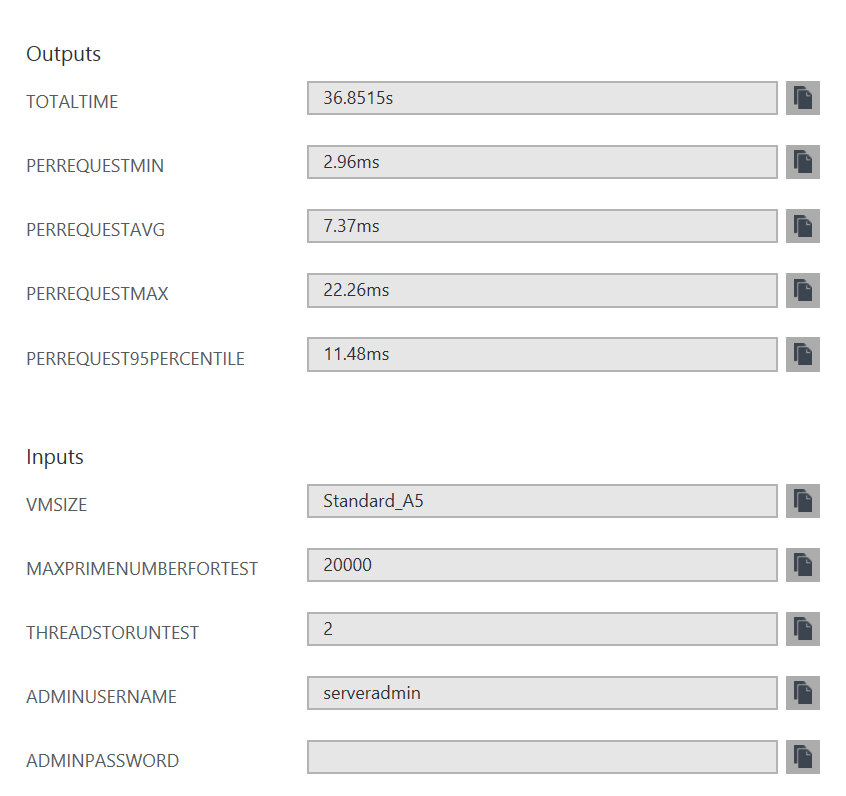

# Azure Sysbench CPU performance meter

<a href="https://portal.azure.com/#create/Microsoft.Template/uri/https%3A%2F%2Fraw.githubusercontent.com%2FAzure%2Fazure-quickstart-templates%2Fmaster%2Fvm-cpu-sysbench-meter%2Fazuredeploy.json" target="_blank">
    
</a>
<a href="http://armviz.io/#/?load=https%3A%2F%2Fraw.githubusercontent.com%2FAzure%2Fazure-quickstart-templates%2Fmaster%2Fvm-cpu-sysbench-meter%2Fazuredeploy.json" target="_blank">
    
</a>


This template allows you to run a CPU performance test using sysbench utility.

Upon template deployment you will have the CPU perfomance automatically measured. You can see the measurements like this:

```powershell
OutputsString           : 
                          Name             Type                       Value     
                          ===============  =========================  ==========
                          totaltime        String                     36.8515s  
                          perrequestmin    String                     2.96ms    
                          perrequestavg    String                     7.37ms    
                          perrequestmax    String                     22.26ms   
                          perrequest95percentile  String                     11.48ms
```



To re-measure and get full ouput you can login to the test VM with credentials you provided during deployment and use this a command like this:

```shell
sysbench --test=cpu --num-threads=10 --cpu-max-prime=20000 run
```

In case you don't need to re-measure, it is safe to delete the created resource group.
