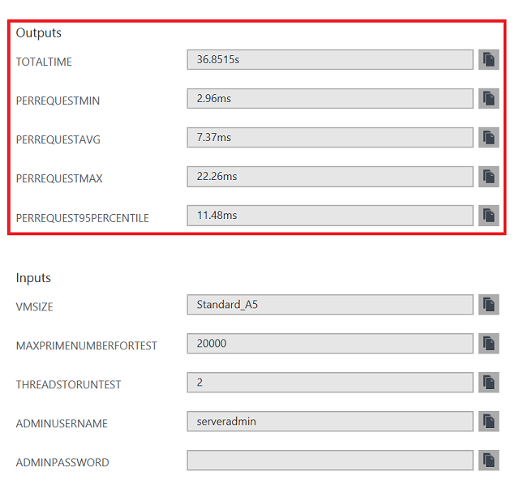

# Azure data disk performance meter

<a href="https://portal.azure.com/#create/Microsoft.Template/uri/https%3A%2F%2Fraw.githubusercontent.com%2FAzure%2Fazure-quickstart-templates%2Fmaster%2Fvm-disk-performance-meter%2Fazuredeploy.json" target="_blank">
    
</a>
<a href="http://armviz.io/#/?load=https%3A%2F%2Fraw.githubusercontent.com%2FAzure%2Fazure-quickstart-templates%2Fmaster%2Fvm-disk-performance-meter%2Fazuredeploy.json" target="_blank">
    
</a>


This template allows you to run a data disk performance test using fio utility.

Upon template deployment you will have the disk perfomance automatically measured. You can see the measurements like this:

```powershell
OutputsString           : 
                          Name             Type                       Value     
                          ===============  =========================  ==========
                          testresult       String                     READ: io=2051.2MB, aggrb=78853KB/s, minb=19713KB/s, maxb=20024KB/s, mint=26222msec, maxt=26636msec; WRITE: io=2044.9MB, aggrb=78613KB/s, minb=19653KB/s, maxb=19963KB/s, mint=26222msec, maxt=26636msec;
```



To re-measure and get full ouput you can login to the test VM with credentials you provided during deployment and use this a command like this:

```shell
sudo fio --runtime 30 /opt/vmdiskperf/t
```

Or make another test, like this:

```shell
sudo echo -e '[io]\nrw=randrw\nsize=128m\ndirectory=/datadisk' | sudo fio -

```

In case you don't need to re-measure, it is safe to delete the created resource group.
