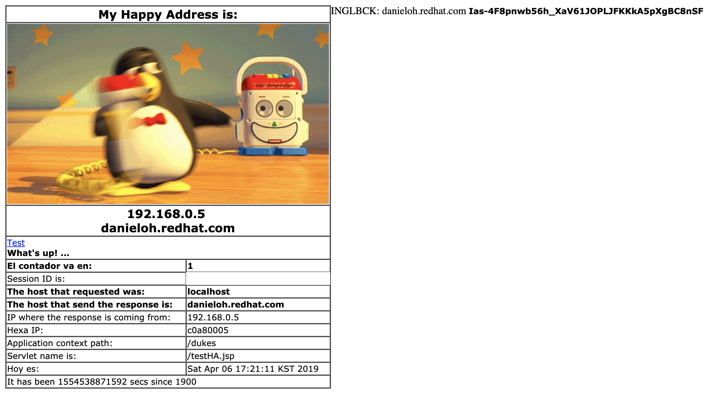
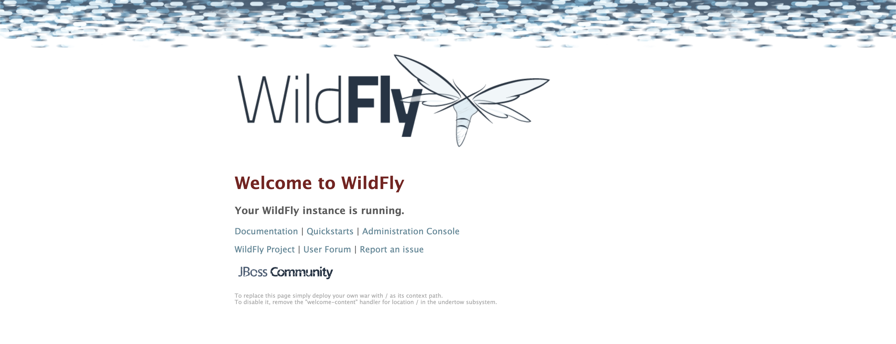

# VM-Redhat - WildFly 16.0.0.Final standalone mode

This template deploys a web applicaton deployed on WildFly 16.0.0.Final running on CentOS 7.

`Tags: WILDFLY, Red Hat, CentOS`

To obtain a rhsm account go to: www.redhat.com and sign in.

## Solution overview and deployed resources
This template creates all of the compute resources to run WILDFLY 16 on top of CentOS 7.5, deploying the following components:
- CentOS 7.5 VM 
- Public DNS 
- Private Virtual Network 
- Security Configuration 
- WildFly 16.0.0.Final
- Sample application deployed to WildFly 16.0.0.Final

To learn more about WildFly 16.0.0.Final, check out:
https://docs.wildfly.org/16/

## Before you Deploy to Azure

To create the VM, you will need to:

1. Choose an admin user name and password for your VM.  

2. Choose a name for your VM. 

3. Choose a WILDFLY username and password to enable the WILDFLY admin console and deployment method. 

4. Choose a Passphrase to use with your SSH certificate.  This pass phrase will be used as the Team Services SSH endpoint passphrase.

## After you Deploy to Azure

Once you create the VM, open a web broser and got to **http://<PUBLIC_HOSTNAME>:8080/dukes/** and you should see the applicaiton running:

If you want to access the administration console go to **http://<PUBLIC_HOSTNAME>:8080** and click on the link Administration Console:

## Notes

If you're interested in Red Hat Middleware Azure Quickstart templates, here is:

*  <a href="https://github.com/Azure/azure-quickstart-templates/tree/master/jboss-eap-standalone-rhel7" target="_blank"> [Red Hat JBoss EAP on an Azure VM]</a> - Standalone JBoss EAP 7 with a sample web app on a RHEL 7 Azure VM.

*  <a href="https://github.com/Azure/azure-quickstart-templates/tree/master/jboss-eap-standalone-openshift" target="_blank"> [Red Hat JBoss EAP on OpenShift Container Platform on Azure RHEL VM]</a> - All-in-one OpenShift Container Platform 3 cluster and Red Hat JBoss EAP 7 with a sample web app.

