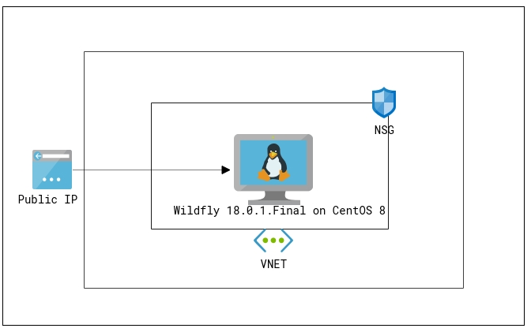
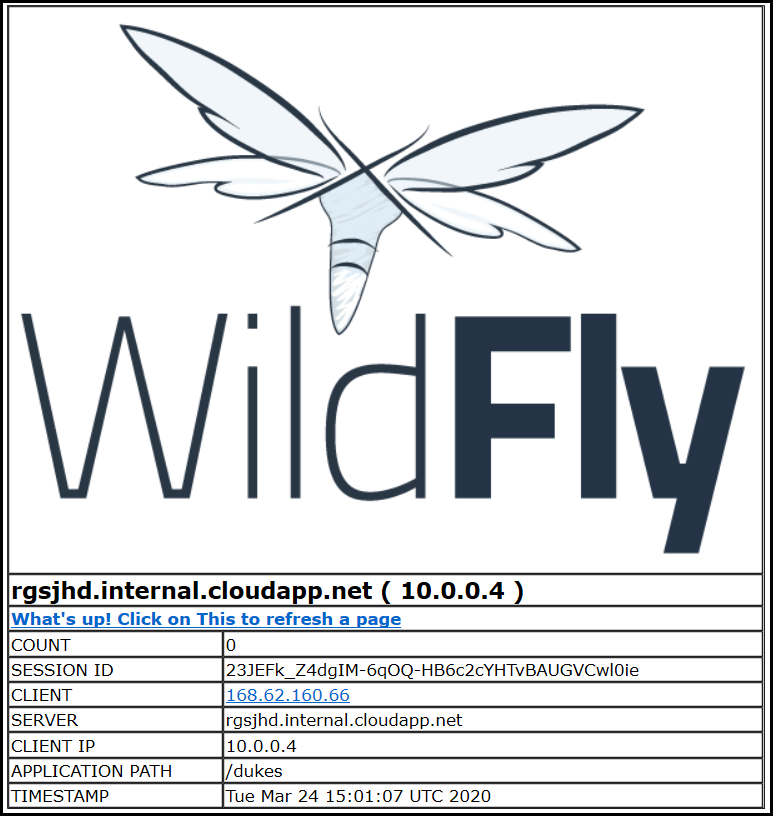
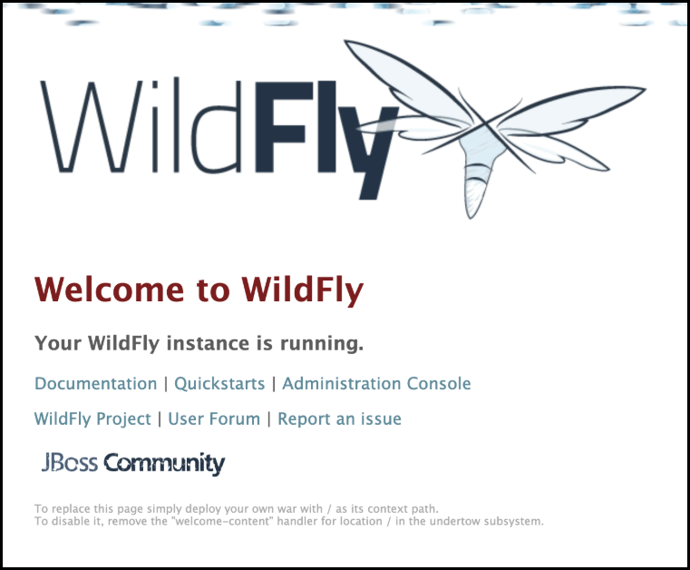

# WildFly 18.0.1.Final standalone mode

`Tags: WILDFLY 18.0.1.Final, CentOS`

<!-- TOC -->

1. [Solution Overview ](#solution-overview)
2. [Template Solution Architecture ](#template-solution-architecture)
3. [Licenses and Costs ](#licenses-and-costs)
4. [Prerequisites](#prerequisites)
5. [Deployment Steps](#deployment-steps)
6. [Deployment Time](#deployment-time)
7. [Validation Steps](#validation-steps)
8. [Notes](#notes)
8. [Support](#support)

<!-- /TOC -->

## Solution Overview
WildFly 18 is the latest release in a series of JBoss open-source application server offerings. WildFly 18 is an exceptionally fast, lightweight and powerful implementation of the Jakarta Platform specifications. The state-of-the-art architecture built on the Modular Service Container enables services on-demand when your application requires them.

This Azure quickstart template deploys a web application named dukes on WildFly 18.0.1.Final running on CentOS 8.

## Template Solution Architecture 

This template creates all of the compute resources to run WildFly 18.0.1.Final on top of CentOS 8.0, deploying the following components:

- CentOS 8 VM 
- Public IP 
- Virtual Network 
- Network Security Group 
- WildFly 18.0.1.Final
- Sample application named dukes deployed on WildFly 18.0.1.Final

Following is the Architecture :

To learn more about WildFly 18.0.0.Final, check out:
https://docs.wildfly.org/18/

## Licenses and Costs 

Click [here](https://azure.microsoft.com/en-us/pricing/details/virtual-machines/linux/#linux) to view the pricing details of CentOS 8 image which is used for this template. Wildfly does not require any License, for more details click [here](https://www.wildfly.org/).

## Prerequisites 

1. Azure Subscription (CentOS-Based 8.0 is an [Azure Marketplace](https://azuremarketplace.microsoft.com/en-us/marketplace/apps/openlogic.centos?tab=Overview) product)

2. To create the VM, you will need to:

    - Choose an admin username and password for your VM.  

    - Choose a name for your VM. 

    - Choose a WildFly username and password to enable the WildFly admin console and deployment method.

## Deployment Steps  

Build your environment with WildFly 18.0.1.Final on top of CentOS 8.0 on Azure in a few simple steps:  
1. Launch the template by clicking the Deploy to Azure button.  
2. Fill in the following parameter values and accept the terms and conditions before clicking on Purchase.

    - **Subscription** - Choose the right subscription where you would like to deploy.

    - **Resource Group** - Create a new Resource group or you can select an existing one.

    - **Location** - Choose the right location for your deployment.

    - **Admin Username** - User account name for logging into your CentOS VM.

    - **Authentication Type** - Type of authentication to use on the Virtual Machine.

    - **Admin Password or Key** - User account password/ssh key for logging into your RHEL VM.

    - **DNS Label Prefix** - DNS Label for the Public IP and this is also the name of your VM. Must be lowercase. It should match with the following regular expression: ^[a-z][a-z0-9-]{1,61}[a-z0-9]$ or it will raise an error.

    - **WildFly Username** - Username for WildFly Manager.

    - **WildFly Password** - User account password for WildFly Manager.

    - Leave the rest of the parameter values as it is and proceed.

## Deployment Time 

The deployment takes less than 10 minutes to complete.

## Validation Steps

- Once the deployment is successful, go to the VM and copy the DNS Name of the VM.
- Open a web browser and go to **http://<PUBLIC_HOSTNAME>:8080/dukes/** and you should see the application running:

  

- To access the administration console go to **http://<PUBLIC_HOSTNAME>:8080** and click on the link Administration Console:

  

## Notes

If you're interested in Red Hat JBoss EAP Azure Quickstart templates, you can find it here:

*  <a href="https://github.com/Azure/azure-quickstart-templates/tree/master/jboss-eap-standalone-rhel7" target="_blank"> [Red Hat JBoss EAP on RHEL 7.7 VM]</a> - Standalone JBoss EAP 7.2 with a sample web app on a RHEL 7.7 Azure VM.

*  <a href="https://github.com/Azure/azure-quickstart-templates/tree/master/jboss-eap-standalone-rhel8" target="_blank"> [Red Hat JBoss EAP on RHEL 8.0 VM]</a> - Standalone JBoss EAP 7.2 with a sample web app on a RHEL 8.0 Azure VM.

## Support 

For any support related questions, issues or customization requirements, please contact info@spektrasystems.com
